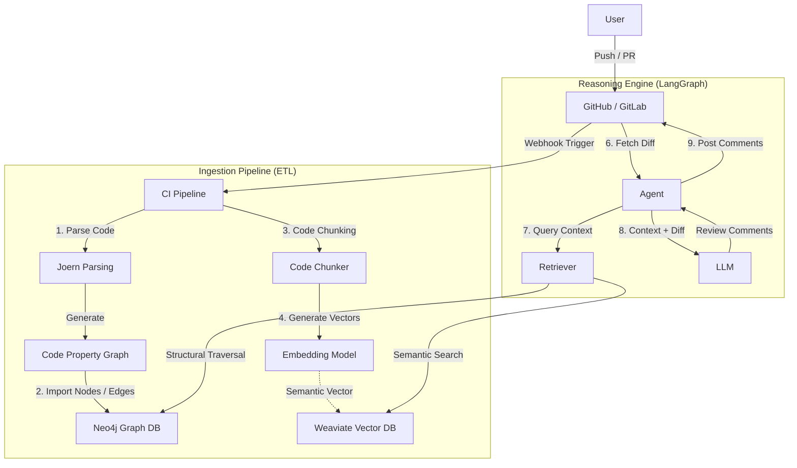

# GraphRAG Code Review Bot

**Tự động hóa Code Review** bằng cách kết hợp **Code Property Graph (CPG)** và **Large Language Models (LLM)**.

---

## Giới thiệu (Introduction)

Trong quy trình phát triển phần mềm hiện đại, việc **review code thủ công** thường trở thành một **nút thắt cổ chai**, trong khi các công cụ **phân tích tĩnh (SAST)** truyền thống lại thiếu khả năng **hiểu ngữ cảnh nghiệp vụ**.

Ở chiều ngược lại, các giải pháp sử dụng **LLM thuần túy** (ví dụ: ChatGPT) thường gặp phải vấn đề **hallucination**, do không có cái nhìn toàn cảnh về **cấu trúc và mối quan hệ bên trong dự án**.

---

## GraphRAG Code Review Bot là gì?

**GraphRAG Code Review Bot** giải quyết bài toán này bằng kiến trúc  
**Graph Retrieval-Augmented Generation (GraphRAG)**.

Thay vì chỉ đọc code như **văn bản thuần túy**, hệ thống tiếp cận code như một **đồ thị liên kết chặt chẽ**, cho phép hiểu sâu cả *ngữ nghĩa* lẫn *cấu trúc*.

---

## ⚙️ Kiến trúc & Công nghệ cốt lõi

Hệ thống kết hợp sức mạnh của ba trụ cột chính:

### Ngữ nghĩa (Semantics)
- Hiểu **ý định của đoạn code**
- Thông qua **Vector Search** với **Weaviate**

### Cấu trúc (Structure)
- Hiểu **luồng dữ liệu**, **quan hệ phụ thuộc**, **call graph**
- Thông qua **Code Property Graph (CPG)** với **Neo4j**

### Suy luận (Reasoning)
- Điều phối các bước phân tích phức tạp
- Thông qua **LangGraph**

### Kết quả là một trợ lý AI có khả năng phát hiện lỗi logic, lỗ hổng bảo mật (injection, taint analysis) và đưa ra gợi ý refactor chính xác ngay trên Pull Request.

---

## 🏗 Kiến trúc Hệ thống (System Architecture)

Hệ thống được thiết kế theo mô hình Hybrid Retrieval, tận dụng cả Vector Embedding (cho ngữ nghĩa) và Graph Embedding (cho cấu trúc).

### Sơ đồ luồng dữ liệu (Data Flow)

